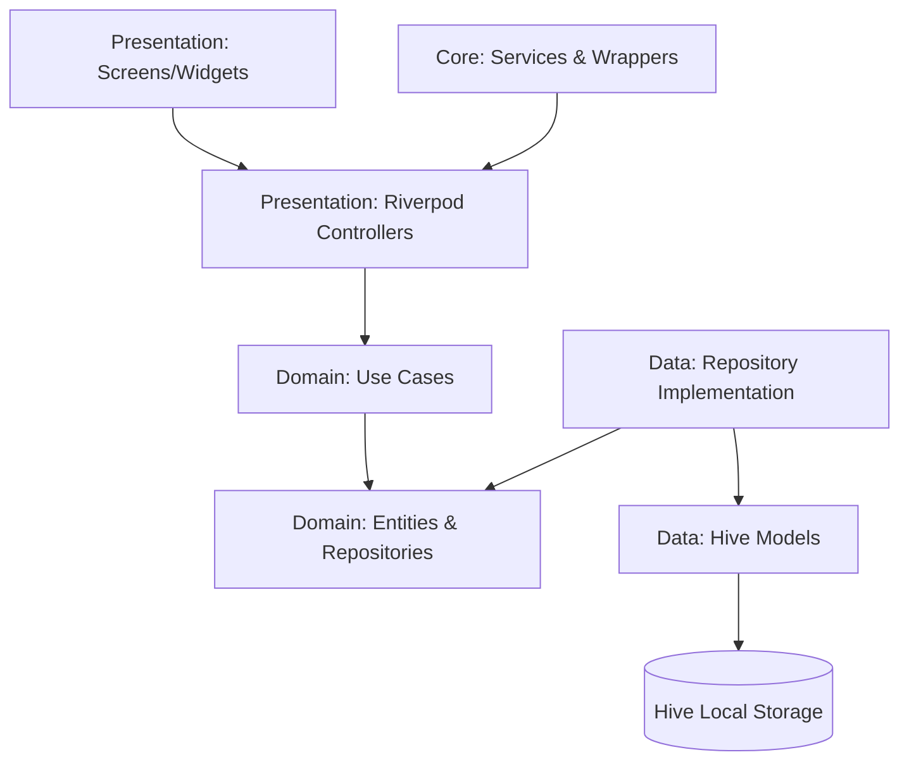

# TimeOrbit ⏰🌌
### *A Premium, High-Performance Neon-Glassmorphic Alarm & Sleep Suite for Android & iOS*

[](https://github.com/bilash-biswas/clean-architecture-alarm-riverpod/raw/main/build/app/outputs/flutter-apk/app-release.apk)

**TimeOrbit** is a production-ready, feature-rich alarm and productivity suite built with Flutter. It combines a stunning neon-glassmorphic UI with robust, low-level OS integrations to guarantee wake-up reliability. 

Designed following **Clean Architecture** principles and powered by **Riverpod** for reactive state management, the codebase showcases advanced native platform configurations, precise background task execution, local offline persistence, and rigorous unit testing.

---

## 🚀 Key Features

### 1. Advanced Wake-Up Missions 🧠
Designed for heavy sleepers, active alarms cannot be dismissed without completing randomized, interactive challenges:
*   **Math Puzzles:** Solve double-digit arithmetic equations with custom difficulty levels (Easy, Medium, Hard).
*   **Physical Shake:** Accelerometer-based challenge requiring energetic device movement.
*   **Captcha Typing:** Strict letter-verification typing to build alert coordination.
*   **Memory Match:** Match symbolic emoji card pairs in a grid.

### 2. Timezone World Clock 🌍
*   Track capital cities globally with synchronized GMT offsets and local ticking times.
*   Dynamic card layouts that change color profiles based on each city's hour (golden blue for day, purple/orange for sunset, and deep navy for night).
*   Instant filter search catalog for adding capital cities.

### 3. Radial Countdown Timer & High-Precision Stopwatch ⏱️
*   **Drift-Free Stopwatch:** Centisecond-level ticking that uses absolute device delta timing to prevent CPU drift. Highlights the fastest split lap in **neon cyan** and the slowest in **neon pink**.
*   **Native-Backed Timer:** A radial countdown timer that registers a native OS alarm under ID `999999`. This guarantees the audio will trigger a fullscreen screen-wake event even if the app is backgrounded, locked, or terminated.

### 4. Sleep Aid & Sleep Journal 🌙
*   **Sleep Sounds:** Continuous relaxing sound loops with a circular sleep timer that fades volume to zero during the final seconds.
*   **Bedtime cycles planner:** Automatically reads your next alarm and suggests optimal bedtimes in 90-minute sleep cycles.
*   **Check-in analytics:** Emoji mood logging upon alarm dismissal, saved in Hive and displayed in a weekly statistics bar chart.

---

## 🛠️ Architecture & Tech Stack

The application strictly adheres to **Clean Architecture** layers to ensure separation of concerns, testability, and ease of maintenance:



### Directory & File Structure 📂
The modular file layout is structured as follows:

```
lib/
├── core/                         # Shareable utilities, theme tokens, and services
│   ├── constants/
│   │   └── app_constants.dart
│   ├── services/                 # Hardware, Database, Audio, and Navigation wrappers
│   │   ├── alarm_service.dart
│   │   ├── audio_service.dart
│   │   ├── database_service.dart
│   │   ├── providers.dart
│   │   ├── router_service.dart
│   │   └── sensor_service.dart
│   ├── theme/
│   │   └── app_theme.dart
│   ├── utils/
│   │   └── alarm_utils.dart
│   └── widgets/
│       └── bottom_nav_bar.dart
├── features/                     # Clean Architecture Feature Domains
│   ├── alarm/                    # Alarm Management & Active Ring Screen
│   │   ├── data/
│   │   │   ├── models/
│   │   │   │   ├── alarm_model.dart
│   │   │   │   └── mission_model.dart
│   │   │   └── repositories/
│   │   │       └── alarm_repository_impl.dart
│   │   ├── domain/
│   │   │   ├── entities/
│   │   │   │   ├── alarm_entity.dart
│   │   │   │   └── mission_entity.dart
│   │   │   ├── repositories/
│   │   │   │   └── alarm_repository.dart
│   │   │   └── usecases/
│   │   │       ├── delete_alarm.dart
│   │   │       ├── get_alarms.dart
│   │   │       └── save_alarm.dart
│   │   └── presentation/
│   │       ├── controllers/
│   │       │   └── alarm_controller.dart
│   │       └── screens/
│   │           ├── alarm_form_screen.dart
│   │           ├── alarm_list_screen.dart
│   │           └── alarm_ring_screen.dart
│   ├── settings/                 # App Preferences (AMOLED Dark Mode)
│   │   └── presentation/
│   │       ├── controllers/
│   │       │   └── settings_controller.dart
│   │       └── screens/
│   │           └── settings_screen.dart
│   ├── sleep/                    # Sleep Sound Aid & Rating Logs Analytics
│   │   ├── data/
│   │   │   └── models/
│   │   │       └── sleep_log_model.dart
│   │   ├── domain/
│   │   │   └── entities/
│   │   │       └── sleep_log_entity.dart
│   │   └── presentation/
│   │       ├── controllers/
│   │       │   ├── sleep_controller.dart
│   │       │   └── sleep_log_controller.dart
│   │       └── screens/
│   │           └── sleep_screen.dart
│   ├── stopwatch/                # Drift-free Lap Stopwatch
│   │   └── presentation/
│   │       ├── controllers/
│   │       │   └── stopwatch_controller.dart
│   │       └── screens/
│   │           └── stopwatch_screen.dart
│   ├── timer/                    # Radial Notification-backed Background Timer
│   │   └── presentation/
│   │       ├── controllers/
│   │       │   └── timer_controller.dart
│   │       └── screens/
│   │           └── timer_screen.dart
│   └── world_clock/              # Timezone Tracker with Hour-adaptive color profiles
│       ├── data/
│       │   └── models/
│       │       └── city_model.dart
│       ├── domain/
│       │   └── entities/
│       │       └── city_entity.dart
│       └── presentation/
│           ├── controllers/
│           │   └── world_clock_controller.dart
│           └── screens/
│               └── world_clock_screen.dart
├── main.dart                     # App bootstrapping & trigger event routing
```

### Stack Components:
*   **State Management:** `flutter_riverpod` (using auto-generating annotations for robust dependency injection and state lifecycle).
*   **Local Persistence:** `hive` & `hive_flutter` (binary-encoded offline storage for ultra-fast load times).
*   **Navigation:** `go_router` (declarative routing supporting deep-linking and lock-screen overlays).
*   **Hardware Sensors:** `sensors_plus` (device accelerometer reading).
*   **Audio Players:** `just_audio` (multi-audio thread controls for soundscapes) and the `alarm` package.

---

## ⚙️ Native System Engineering Highlights

Ensuring an alarm app works reliably across modern Android/iOS systems requires handling restrictive OS power and background restrictions. This project showcases several advanced native patches:

### 1. System Volume HUD Suppression (Android Cache Patch)
To prevent Android's default system volume slider from popping up over the premium full-screen alarm overlay, the native Android service in the `alarm` package was patched.
*   **Location:** `AlarmService.kt` (Pub Cache)
*   **Patch:** Set `showSystemUI = false` to pass `0` instead of `AudioManager.FLAG_SHOW_UI` to the native `AudioManager.setStreamVolume` API. This keeps volume enforcement active but silent visually.

### 2. Android 13/14 Overlay & Background Restrictions
*   **Restricted Settings Bypass:** Android 13+ blocks sideloaded apps from displaying over other apps. The project includes UI and console instructions on bypassing this via the **"Allow restricted settings"** option in Android's App Info menu.
*   **Split Permission Requests:** Requests for `Permission.systemAlertWindow` (overlay) are isolated from standard batch permission requests to prevent settings redirect intents from interrupting the app's startup lifecycle.
*   **System Flags (`MainActivity.kt`):**
    ```kotlin
    if (Build.VERSION.SDK_INT >= Build.VERSION_CODES.O_MR1) {
        setShowWhenLocked(true)
        setTurnScreenOn(true)
    } else {
        window.addFlags(
            WindowManager.LayoutParams.FLAG_SHOW_WHEN_LOCKED or
            WindowManager.LayoutParams.FLAG_TURN_SCREEN_ON or
            WindowManager.LayoutParams.FLAG_KEEP_SCREEN_ON
        )
    }
    ```
*   **Permissions Declared (`AndroidManifest.xml`):**
    *   `SCHEDULE_EXACT_ALARM` & `USE_EXACT_ALARM` (Precise timing).
    *   `RECEIVE_BOOT_COMPLETED` (Reschedules alarms automatically on device reboot).
    *   `WAKE_LOCK` & `USE_FULL_SCREEN_INTENT` (Bypasses lock screen and turns the display on).

---

## 🧪 Testing & Code Quality

*   **Unit Tests:** Complete coverage of core helpers, Date time calculations, World Clock timezone conversions, Sleep Log math, and Controller initialization states.
    *   *To run tests:* `flutter test` (13/13 passing checks).
*   **Static Analysis:** Fully strict Flutter lints. Zero warnings or compile issues (`flutter analyze` clean).
*   **Memory Safety:** Riverpod controllers securely handle unmounts, disposing of sensor listeners to prevent memory leaks (`Bad state: Cannot use "ref" after the widget was disposed` resolution).
